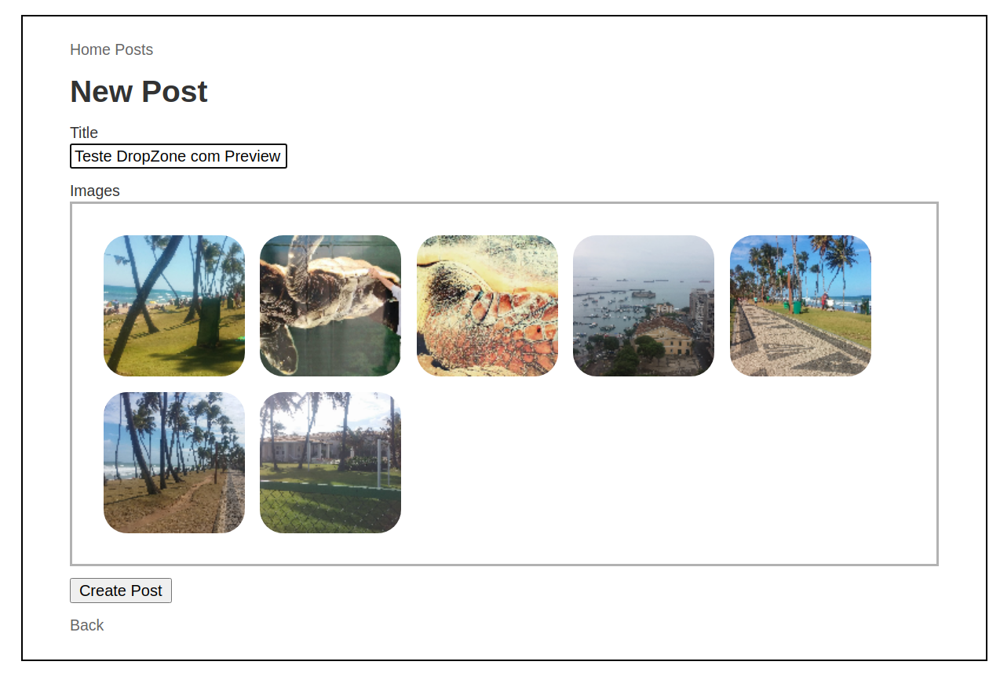
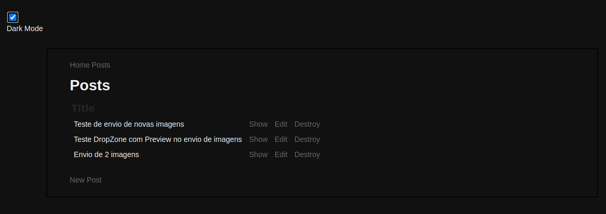

# DropZone 

## Multiple file upload with ActiveStorage, StimulusJS and DropZone.

## added Dark Mode.

This README would normally document whatever steps are necessary to get the
application up and running.

Things you may want to cover:

* Ruby version
  2.6.5

* System dependencies
  Rails 6.0.3.4

* Configuration

* Database creation
  rails db:setup

* Database initialization

* How to run the test suite

* Services (job queues, cache servers, search engines, etc.)

* Deployment instructions

* ...
